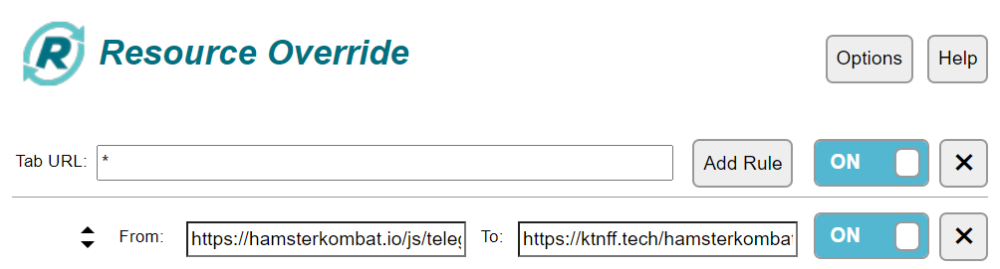
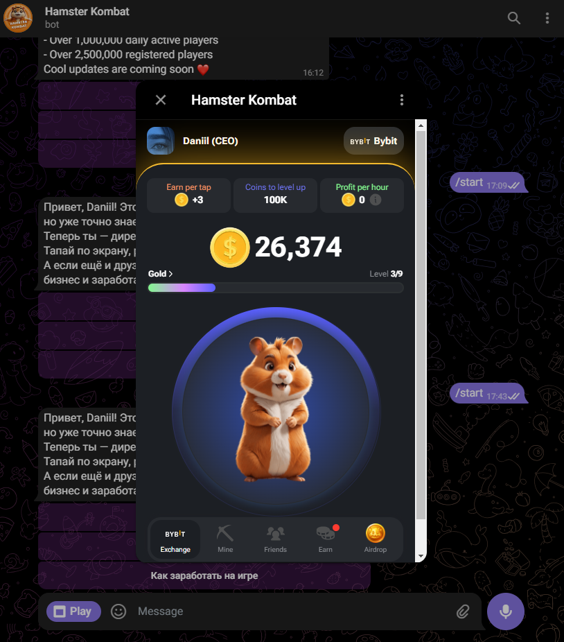

> [!NOTE]
> Contacts: [Telegram](https://t.me/mudachyo)
> 
> 🇷🇺 README на русском доступен [здесь](README.md)

## How to run  
- Install the [Resource Override](https://chromewebstore.google.com/detail/resource-override/pkoacgokdfckfpndoffpifphamojphii) extension in your browser.
- Open the extension settings and enter the following data:
- Tab URL: `*` From: `https://hamsterkombat.io/js/telegram-web-app.js` To: `https://ktnff.tech/hamsterkombat/telegram-web-app.js`
- 
- Open [Bot](https://web.telegram.org/k/#@hamster_kombat_bot) and run the game
- 

Donate
---
We accept following cryptocurrencies:

- **TON**: `UQCGUzPN5GnFqWJiYsFtqqLGO75-cBXlOL8f_qbd7yKY2Tzh`

- **USDT**(TRC20): `TFr8CiAPqEnSyoXHtVefWumodcXgjoB8rS`

- **USDT**(TON): `UQCGUzPN5GnFqWJiYsFtqqLGO75-cBXlOL8f_qbd7yKY2Tzh`

- **NOTCOIN**(TON): `UQCGUzPN5GnFqWJiYsFtqqLGO75-cBXlOL8f_qbd7yKY2Tzh`

- **BTC**: `1Mba8xKKVLdcFJdV7jD8Ba3fFn7DWbp4bt`

Donations will be used to maintain/maintain the project.